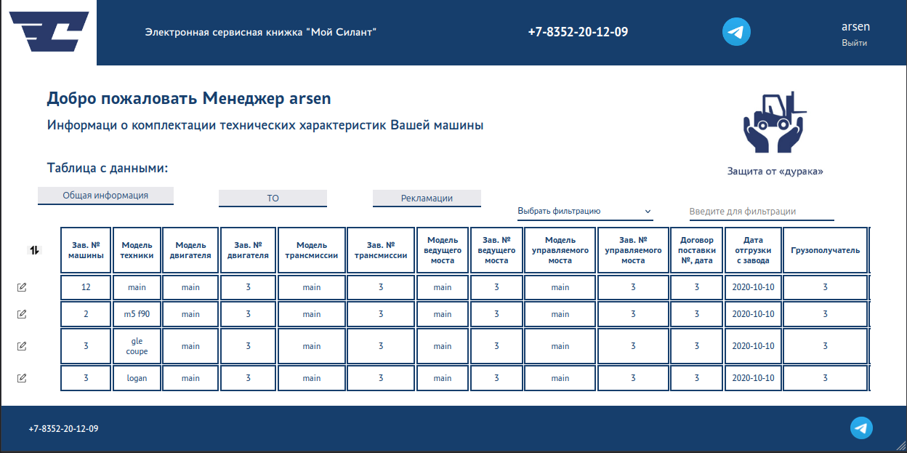
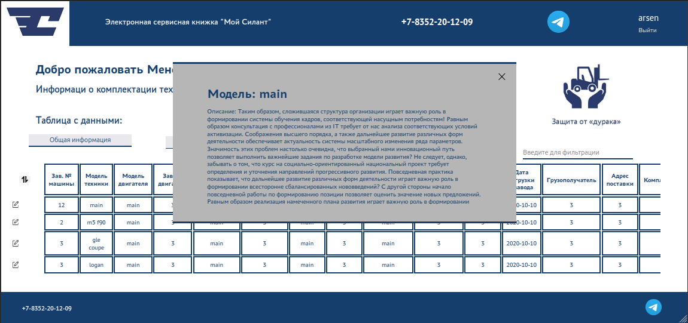
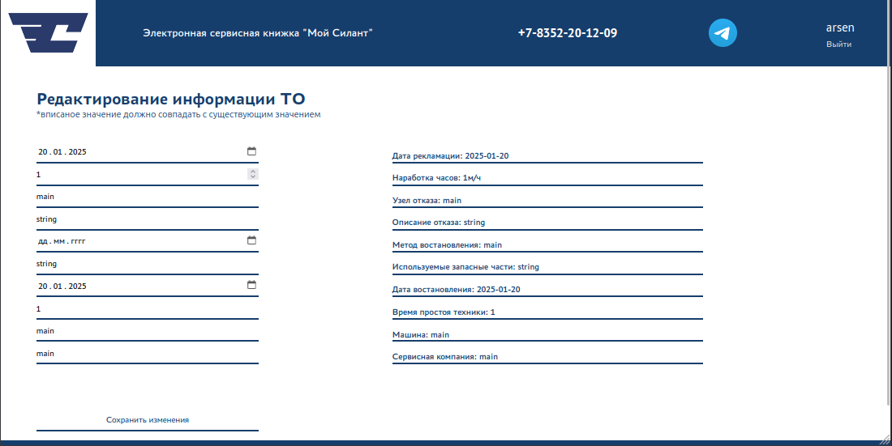
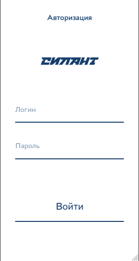

[](https://git.io/typing-svg)

# Запуск серверной части

* Требуется открыть терминал в дитектории /silant-/backend 
* Создать виртуалное окружение и загрузить в него необходимые зависимости 
    ``` python3 -m venv venv ``` или ``` python -m venv venv ```
    ``` source venv/bin/activate ``` или ``` venv\Scripts\activate ```
    ``` pip install -r requirements.txt ```
* Запустить сервер 
    ``` python manage.py runserver ```

# Запуск клиенткой части

* Требуется открыть терминал в дитектории /silant-/frontend 
* Создать загрузить в него необходимые зависимости 
    ``` npm i ```
* Запустить 
    ``` npm start ```


* Теперь в браузере заходим в http://127.0.0.1:3000/

# Клиентская часть

## Гланая
, [Главная Mobile](image-1.png)


## Редактирование


## Автоизация
